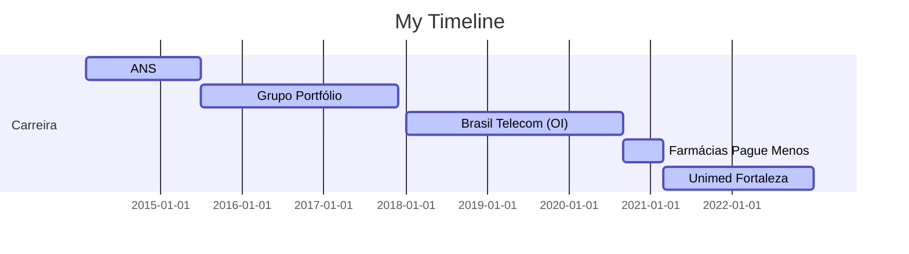

# Olá, eu sou o Eric

Bacharel em Informática, MBA em Gerenciamento de Projetos e pós-graduando em Banco de Dados e Big Data. Profissional com mais de 20 anos de experiência em tecnologia da informação, tendo trabalhado em grandes organizações públicas e privadas nos segmentos de saúde, varejo, telecomunicações, construção civil, indústria, bancos, educação, consultoria e fábrica de software. 
Como analista de negócios, atuei por 10 anos na implantação, consultoria e sustentação do sistema ERP Corpore RM da TOTVS, com ênfase nos módulos de backoffice (Departamento Pessoal, Automação de Ponto, Recursos Humanos, Segurança e Medicina do Trabalho, Financeiro, Contabilidade, Compras).
Nós últimos 8 anos venho atuando fortemente na área de engenharia de dados, business intelligence, administração de banco de dados, data quality, análise, arquitetura de dados e Big Data.

Skills: Python / SQL / Engenharia de Dados / Análise de Dados
  

 
   

## Atuação profissional

:computer: Engenheiro de Dados - Unimed Fortaleza (03.2021 - Atual)

:computer: Analista de Business Intelligence Sênior - Farmácias Pague Menos (09.2020 - 02.2021)

:computer: Especialista Big Data - Brasil Telecom (OI) (01.2018 - 09.2020)

:computer: Analista de Business Intelligence Sênior - Grupo Portfólio (Unimed Fortaleza) (07.2015 - 12.2017)

:computer: Analista de Business Intelligence (Servidor Público) - ANS (Agência Nacional de Saúde Suplementar) (02.2014 - 07.2015)

## Formação Acadêmica

:newspaper_roll: MBA em Banco de Dados e Big Data - FATESG/SENAI GO (2019 - 2021)

:newspaper_roll: MBA em Gerenciamento de Projetos - FGV (2008 - 2010)

:newspaper_roll: Bacharel em Informática - UNIFOR/Universidade de Fortaleza (2000 - 2005)
